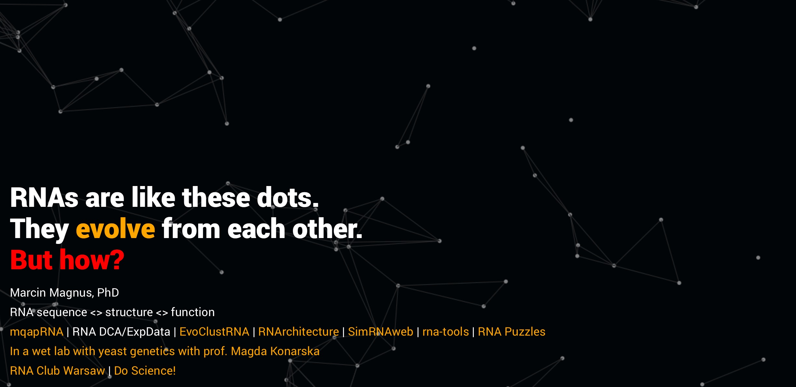

<!---->

🎓 Ph.D., Computational RNA biologist at Harvard University, USA

I'm trying to understand the evolution and role of RNA and RNPs in biological systems using computational methods (machine learning, molecular dynamics, structure prediction) and experimental (yeast genetics) and codify this knowledge into predictive computational models that can be applied for future RNA therapeutics.

https://mmagnus.github.io 

Key papers: 

- *Rearrangements within the U6 snRNA core at the transition between the two catalytic steps of splicing* with Konarska @IMOL, Poland, 2019
- *RNA 3D Structure Prediction Using Multiple Sequence Alignment Information* with Das and Bujnicki @ Stanford University, USA & IIMCB, Poland, 2019
- *RNA-Puzzles toolkit: A computational resource of RNA 3D structure benchmark datasets, structure manipulation, and evaluation tools* with the RNA-Puzzle Team @ IIMCB & IMOL, Poland, 2020 & the server [https://rna-tools.online](http://rna-tools.online) 2022-
- RNA 3D structure prediction using Deep learning, with Rivas, @Harvard, US, 2023-

RNA
https://github.com/mmagnus?tab=repositories&q=rna&type=&language=&sort

Emacs
https://github.com/mmagnus?tab=repositories&q=emacs&type=&language=&sort

See my projects @Github https://github.com/mmagnus?tab=repositories&q=&type=&language=&sort=stargazers
